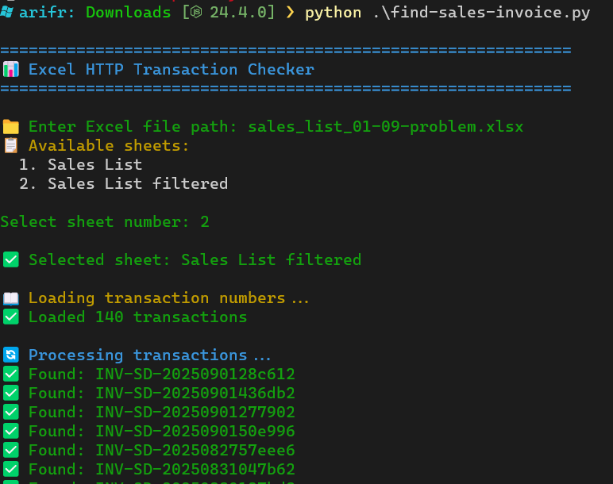

# How to install

Install dependencies `pip install pandas requests tqdm colorama openpyxl`.

Then execute `python.exe invoice finder.py`, you will fill file name and choose which sheet.

Result with automatically write a text file, which is contain not found invoice number.

